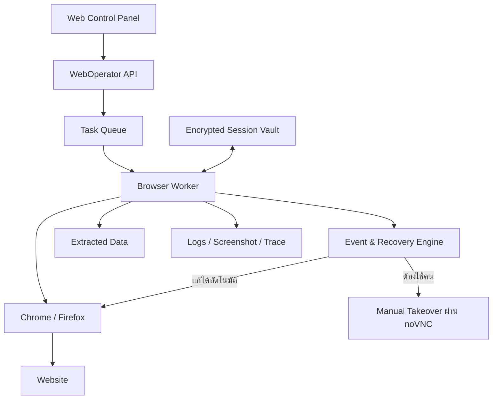
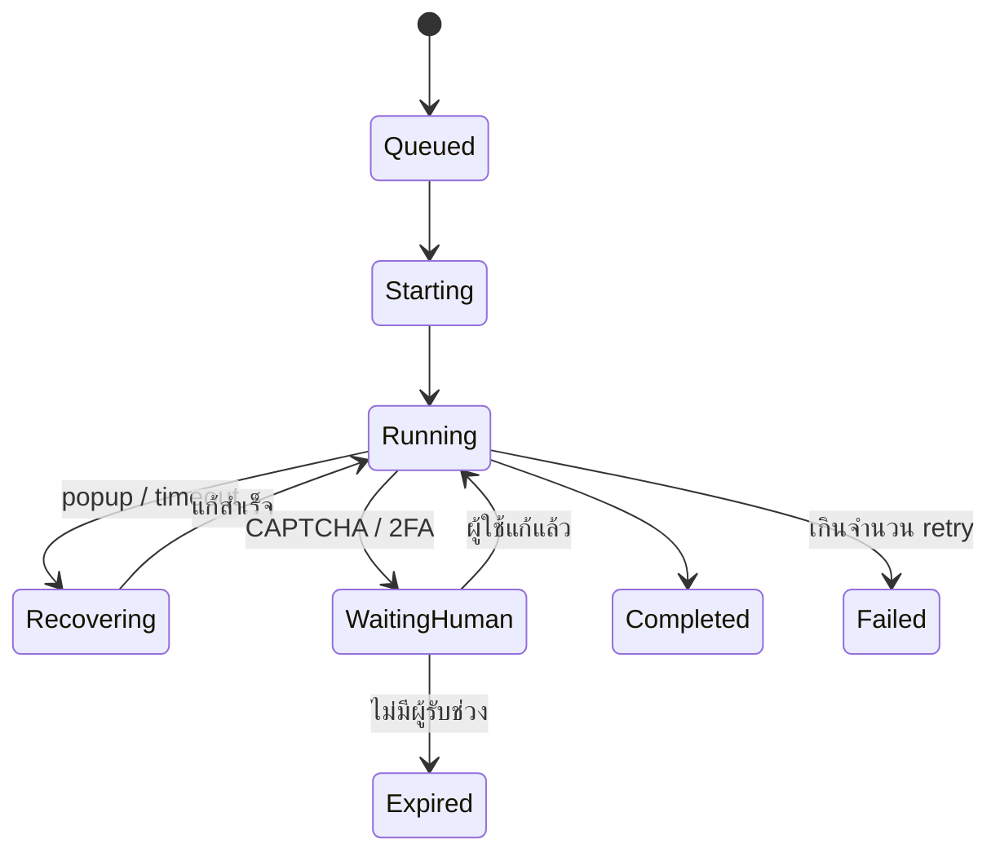

# WebOperator

**WebOperator** คือระบบอัตโนมัติสำหรับเข้าใช้งานเว็บไซต์และ Gmail แทนคน โดยไม่ทำงานเป็นสคริปต์ยาวชุดเดียว แต่แบ่งเป็นส่วนต่าง ๆ ที่แยกความรับผิดชอบชัดเจน:

- ระบบกลางจัดคิวงาน (Task Queue)
- Browser Worker ที่รันใน Docker
- ชุดคำสั่งเฉพาะแต่ละเว็บไซต์ (Site Adapter)
- ระบบจัดการเหตุการณ์ไม่คาดคิด (Event & Recovery Engine)
- หน้าจอควบคุมและรับช่วงทำงานด้วยมือ (Manual Takeover)
- ระบบเก็บ Session/Cookie อย่างเข้ารหัส (Session Vault)

## Repository

- GitHub: <https://github.com/smallscaleserver/WebOperator>
- License: [GNU AGPL v3](./LICENSE)

### Clone

```bash
git clone https://github.com/smallscaleserver/WebOperator.git
cd WebOperator
```

หรือ clone ผ่าน SSH:

```bash
git clone git@github.com:smallscaleserver/WebOperator.git
```

### คู่มือทดสอบระบบแบบ Step-by-step (Testing Guide)

ถ้าต้องการคู่มือแบบสั้นที่ทำตามเพื่อเปิด local UI ที่
`http://localhost:4000` ทันที ดู [`StepByStep.md`](./StepByStep.md)
ก่อน ส่วน section นี้เป็นรายละเอียด testing guide แบบเต็มกว่า ถ้า Docker
image/container ค้างหรืออยากล้างทุกอย่างแล้วสร้างใหม่ทั้งหมด ดู
[`CleanAll.md`](./CleanAll.md) — ถ้าจะใช้ฟีเจอร์ Recorder
(record→analyze→run บันทึกการคลิก/พิมพ์บนเว็บจริงแล้วรันซ้ำได้ ใช้ได้
กับ lane ไหนก็ได้) ดู
[`UniversalRecorderUsage.md`](./UniversalRecorderUsage.md) โดยเฉพาะ

ครอบคลุม flow หลักที่ implement และ verify แล้วจนถึงตอนนี้ (Phase 1-2
เต็ม — ยังไม่รวม Gmail/Phase 3 ซึ่งเป็น dev scaffold แยกต่างหาก ดู
[AGENTS.md](./AGENTS.md))

#### สิ่งที่ต้องมีก่อน (Prerequisites)

- **Docker Desktop** ติดตั้งแล้วและ **เปิดอยู่** (Docker daemon ต้อง
  running ก่อนรันคำสั่งใด ๆ ด้านล่าง)
- **Node.js + npm** (สำหรับรัน Control Panel บน host — Control Panel
  ไม่ได้รันใน container)
- Clone repo แล้ว copy env ครั้งแรกครั้งเดียว: `cp .env.example .env`

#### 1. ติดตั้ง dependencies ของ Control Panel

```bash
cd services/control-panel
npm install
```

#### 2. เริ่ม Redis, MinIO และ browser worker(s)

```bash
docker compose up -d redis minio browser-worker-chrome browser-worker-firefox
```

(ตัด `browser-worker-firefox` ออกได้ถ้ายังไม่ทดสอบ Firefox demo ในข้อ 12)

MinIO console (ดู object ที่ archive ไว้โดยตรง แยกจาก UI ของ Control
Panel): <http://localhost:9001> — login ด้วย `MINIO_ROOT_USER`/
`MINIO_ROOT_PASSWORD` ใน `.env` (default `weboperator`/`changeme123`)

#### 3. เริ่ม Control Panel API (terminal ที่ 1)

```bash
cd services/control-panel
npm start
```

จะเห็น `WebOperator Control Panel: http://localhost:4000` — terminal นี้
เสิร์ฟ UI/API และ enqueue งานเท่านั้น **ยังไม่รันงานจริง** จนกว่าจะเริ่ม
queue worker ในข้อถัดไป

#### 4. เริ่ม queue worker (terminal ที่ 2 แยกจากข้อ 3)

```bash
cd services/control-panel
npm run worker
```

จะเห็น `Queue worker ready — waiting for jobs.` — งานที่ enqueue จากข้อ 3
จะค้างอยู่ใน queue จนกว่า terminal นี้จะรันอยู่ (ไม่หาย แค่รอ)

#### 5. เปิด Control Panel

เปิด <http://localhost:4000> — ควรเห็นสถานะ Chrome/Firefox เป็น
"stopped" (จุดสีเทา) หัวข้อ **System Health** บนสุดของหน้าเป็น read-only
diagnostics ครอบคลุม Docker services/Control Panel API/queue worker/
Redis/MinIO/XC Bank URL/noVNC ทั้งหมด — กด **Diagnostics →** เพื่อดู
รายละเอียดทีละ service ที่ <http://localhost:4000/health> ถ้ามีอะไรไม่
พร้อม หน้านี้จะบอกคำสั่งที่ควรรันเอง ไม่ auto-start อะไรให้เองทั้งสิ้น

#### 6. Start Chrome และ/หรือ Firefox

กดปุ่ม **Start** ข้าง Chrome (และ/หรือ Firefox ถ้าเริ่ม container ไว้ใน
ข้อ 2) — จุดสถานะเปลี่ยนเป็นสีเขียว "running" ภายในไม่กี่วินาที

#### 7. Take control ผ่าน noVNC

กดปุ่ม **Take control** — เห็นหน้าจอ desktop จริงของ Chrome/Firefox ฝัง
(iframe) อยู่ในหน้าเดียวกัน คลิก/พิมพ์ได้เหมือน remote desktop จริง (หรือ
เปิดแยกเต็มจอที่ <http://localhost:6080/vnc.html> สำหรับ Chrome,
<http://localhost:6081/vnc.html> สำหรับ Firefox แล้วใส่รหัสผ่านจาก
`VNC_PASSWORD` ใน `.env`)

#### 8. รัน demo workflow

กดปุ่ม **Run demo (navigate + screenshot)** ใต้หัวข้อ "Playwright
worker" (หรือปุ่ม `Run "demo"` ใต้หัวข้อ "Workflows" ด้านล่าง — เป็น
workflow เดียวกัน คนละทางเข้าเฉย ๆ) จะ enqueue งานที่ navigate ไป
example.com แล้วถ่าย screenshot

#### 9. Save / Restore session

กด **Save session** — ตั้ง cookie/localStorage marker ปลอมบน
example.com แล้วบันทึกเป็น Playwright `storageState` จากนั้นกด
**Restore session** — เปิด browser context ใหม่แยกต่างหาก โหลด session
ที่เพิ่ง save กลับมา แล้วอ่านค่า marker ยืนยันว่า round-trip สำเร็จ (ดูค่า
ที่ restore ได้ในรายละเอียด step ของ job)

#### 10. รัน example adapter / the-internet workflow

กดปุ่ม **Run example adapter** (หรือ `Run "the-internet-login"` ใต้
Workflows) — login เข้าเว็บทดสอบ the-internet.herokuapp.com จริง (dismiss
popup โฆษณา, กรอก login, ตรวจข้อความยืนยัน, save session, ถ่าย
screenshot) เป็น flow ที่ครบวงจรที่สุดในตอนนี้

#### 11. ดู job steps, screenshots และลิงก์ MinIO

ในตาราง Jobs ด้านล่าง คลิกแถวของ job (ID ล่าสุด) เพื่อขยายดูรายละเอียด
ทีละ step — แต่ละ step มี ✅/❌ พร้อมเวลาที่ใช้ ถ้า step เป็น screenshot
จะมีลิงก์สองอัน:

- **screenshot** — ไฟล์จาก local disk (`data/worker-output/`)
- **MinIO** — ไฟล์เดียวกันที่ archive ไปเก็บใน MinIO ด้วย (ปรากฏเฉพาะตอน
  archive สำเร็จ — ดู Troubleshooting ด้านล่างถ้าไม่ขึ้น)

คลิกดูได้ทั้งสองลิงก์ ควรเป็นภาพเดียวกัน

#### 12. ทดสอบ Firefox demo

ต้อง Start Firefox ก่อน (ข้อ 6) แล้วกดปุ่ม **Run Firefox demo** — ใช้
กลไกคนละแบบจาก Chrome (Playwright `launchServer()`/`connect()` ไม่ใช่
CDP) หน้าที่เปิดจะหายไปจาก noVNC หลัง job จบ — เป็นพฤติกรรมที่ตั้งใจ
ไม่ใช่ bug (ดู decision log ใน `docs/PROJECT_PLAN.md`)

#### 13. หยุดและล้างระบบ (Stop / Cleanup)

หยุด Control Panel ทั้งสอง terminal (Ctrl+C ทั้งคู่) แล้ว:

```bash
docker compose down
```

บน Windows ให้ตรวจสอบว่า process ทั้งสองปิดจริง — ดูหัวข้อ
Troubleshooting ด้านล่างถ้า Ctrl+C ไม่พอ

---

#### ทดสอบ XC Bank (mock bank site, เสริม)

`services/xc-bank` เป็นเว็บธนาคารจำลองที่แยกจาก WebOperator เด็ดขาด (ไม่
share code/DB/queue ใด ๆ — สื่อสารกันได้ทาง browser/HTTP เท่านั้น
เหมือนเว็บภายนอกจริง) สร้างไว้สำหรับฝึก/ทดสอบ browser automation โดยไม่
ต้องพึ่งเว็บภายนอก

**14. เริ่ม xc-bank เพิ่มจากข้อ 2**

```bash
docker compose up -d xc-bank
```

ทดสอบว่าเข้าถึงได้จาก host: เปิด <http://localhost:4100/login> — จะเห็น
หน้า login พร้อม test account ที่ประกาศอยู่บนหน้าเว็บ (`demo_user` /
`demo_pass` — เป็น mock เท่านั้น ไม่ใช่ credential จริง)

**15. รัน XC Bank workflow**

ที่ Control Panel (<http://localhost:4000>) กดปุ่ม `Run
"xc-bank-login-extract"` ใต้หัวข้อ "Workflows" (ปรากฏอัตโนมัติทันทีที่
`services/worker/workflows/xc-bank-login-extract.json` มีอยู่ ไม่ต้อง
setup เพิ่ม) — จะ login สองหน้า (`/login` → `/password`) แล้วเข้า
`/dashboard`, ดึงยอดคงเหลือและรายการธุรกรรมจาก DOM จริง แล้วถ่าย
screenshot

**16. ตรวจผลลัพธ์**

- คลิกแถว job ในตาราง Jobs เพื่อดู step detail — step
  `xcBankExtractDashboard` จะโชว์สรุปยอดคงเหลือ/จำนวนธุรกรรมที่ดึงมาได้
  จริง (เช่น `Balance: $3222.55 | 8 transaction(s)`)
- คลิกลิงก์ **screenshot**/**MinIO** ของ step `screenshot` เพื่อดูภาพหน้า
  dashboard จริง
- รัน workflow ซ้ำอีกครั้งโดยไม่ปิด `browser-worker-chrome` — step
  `xcBankLogin` รอบสองควรขึ้นว่า "session reused, password step skipped"
  (session cookie ยังอยู่จากรอบแรก) แทนที่จะ login ใหม่ทั้งหมด
- รีเฟรชหน้า `/dashboard` เร็ว ๆ (ภายใน ~10 วินาที) ยอดจะเท่าเดิม รอเกิน
  10 วินาทีแล้วรีเฟรชใหม่ ยอดจะเปลี่ยน — พิสูจน์ว่าดึงจากหน้าเว็บจริง
  ไม่ได้ hard-code ไว้ หรือกดปุ่ม "Regenerate data (dev-only)" บนหน้า
  dashboard เพื่อบังคับเปลี่ยนข้อมูลทันที

**17. ทดสอบ Login/Logout flow ทั้งหมด**

Login มี 3 แบบ (`xcBankLogin` step แสดงผลต่างกันตามสถานการณ์) — ทดสอบผ่าน
noVNC (Take control ที่ Chrome) หรือเปิด <http://localhost:4100/login>
เองก็ได้:

- **Fresh login** (ยังไม่มี cookie เลย) — เห็นหน้า username ก่อน กรอก
  `demo_user` กด Continue แล้วค่อยเห็นหน้า password ปกติ. Step
  `xcBankLogin` จะขึ้น "fresh two-step login"
- **Session reuse** (login ค้างอยู่แล้ว, ยังไม่ logout) — เปิด `/login`
  ซ้ำจะเด้งตรงไป `/dashboard` เลย ไม่ต้องกรอกอะไร. Step ขึ้น "session
  reused, password step skipped"
- **Logout** (ปุ่ม `Logout` บนหน้า `/dashboard`) — เว็บจะจำ username ไว้
  เปิด `/login` อีกครั้งจะเด้งไปหน้า password ตรง ๆ ไม่ต้องกรอก username
  ซ้ำ (เหมือนธนาคารจริงที่จำ username ไว้ให้). Step `xcBankLogin` รอบ
  ถัดไปจะขึ้น "Username remembered as demo_user (site skipped straight
  to password)"
- **Logout clean** (ปุ่ม `Logout clean` บนหน้า `/dashboard` หรือ
  `/password`) — **เป็น dev/test helper เท่านั้น ไม่ใช่พฤติกรรมของ
  ธนาคารจริง** — ล้าง session/cookie ทั้งหมด เปิด `/login` อีกครั้งจะเห็น
  หน้า username ใหม่ทั้งหมด (fresh) เหมือนไม่เคย login มาก่อน. ใช้รีเซ็ต
  สถานะทดสอบให้กลับไปเริ่มจากศูนย์ได้ง่าย ๆ โดยไม่ต้องรอ session
  หมดอายุเอง

**Reset state ผ่าน workflow (ไม่ต้องคลิกเอง)**: รัน workflow
`xc-bank-logout-clean` ก่อน (ทำหน้าที่เดียวกับกดปุ่ม Logout clean แต่ทำ
ผ่าน browser automation จริง ไม่ใช่เรียก endpoint ตรง ๆ) แล้วค่อยรัน
`xc-bank-login-extract` — step `xcBankLogin` ต้องขึ้น "fresh two-step
login" อีกครั้ง ยืนยันว่า reset สำเร็จจริง ไม่ใช่แค่ endpoint ตอบ 200

**18. ทดสอบ XC Bank Monitor (bot วนตรวจต่อเนื่อง)**

หน้าแยกต่างหากจาก noVNC — ไม่ใช่หน้าควบคุม browser เอง เป็นแค่หน้าดูผล
(read-only) ของ bot ที่วนเข้าไปเช็ค XC Bank dashboard เองเป็นระยะ

เปิด <http://localhost:4000> (หน้านี้คือ Control Center รวม — browser
controls/noVNC/worker actions/workflows เดิมยังอยู่ครบ) แล้วดูหัวข้อ
**Monitors** — จะเห็น card ของ XC Bank พร้อมสถานะ (running/stopped/
error), summary ล่าสุด, last checked และปุ่ม Start/Stop/Check once
ในตัว, กด **Detail** เพื่อเข้าหน้ารายละเอียด
(<http://localhost:4000/monitors/xc-bank>) — จะเห็นสถานะเต็ม, ยอดคงเหลือ,
notifications, ตารางรายการล่าสุด และ screenshot timeline เป็นรูปจริง
(คลิกรูปเพื่อเปิดเต็มในแท็บใหม่), หรือกด **Live** เพื่อเข้าหน้า Live View
(ดูข้อ 19 ด้านล่าง)

หัวข้อ Monitors บนหน้าแรกอ่านข้อมูลจาก `GET /api/monitors` แบบ dynamic
— ถ้าในอนาคตมี monitor เว็บอื่นเพิ่มเข้ามา จะโผล่ในหน้านี้ให้เองโดยไม่ต้อง
แก้ UI

- กด **Check once** — ทดสอบการเช็คครั้งเดียวก่อน ควรเห็นยอดคงเหลือ/
  รายการธุรกรรมขึ้นจริงภายในไม่กี่วินาที (ผ่าน real browser automation
  เหมือน `xc-bank-login-extract` — session-aware เหมือนกันทุกอย่าง)
- กด **Start monitor** — bot จะเช็คทันทีหนึ่งรอบ แล้ววนเช็คซ้ำทุก ~20
  วินาที (ปรับได้ผ่าน env var `XC_BANK_MONITOR_INTERVAL_MS`) — ปล่อยทิ้ง
  ไว้สักครู่แล้วรีเฟรชหน้า ควรเห็น "Last checked" ขยับเองโดยไม่ต้องกด
  อะไรเพิ่ม
- ก่อนกด Start ลองใส่ตัวเลขในช่อง **"Run for ___ min"** (1-240 นาที) ถ้า
  อยากให้ bot หยุดวน loop เองอัตโนมัติหลังผ่านไป N นาที — ป้องกัน
  ความเสี่ยงเผลอปล่อย loop ค้างรันนานหลายชั่วโมงโดยไม่มีคนดูแล (สำคัญมาก
  ถ้าจะเอาไปชี้ที่เว็บจริง ไม่ใช่แค่ XC Bank mock) เว้นว่างไว้ = รันไม่
  จำกัดเวลาเหมือนเดิม ระหว่างรันจะเห็น "Auto-stop: ~HH:MM:SS"; เมื่อครบ
  เวลาจะเห็น "⏱ Auto-stopped after N minute(s)" และ **Check once** ยังกด
  ได้ปกติแม้หลัง auto-stop ไปแล้ว
- รอให้ transaction data เปลี่ยน (รอเกิน ~10 วินาทีต่อรอบ หรือกดปุ่ม
  "Regenerate data" บนหน้า dashboard เอง) แล้วดูที่หัวข้อ
  **Notifications** — ควรเห็นเฉพาะรายการที่ *ใหม่จริง* เท่านั้น
  เรียงตามเวลา ไม่ซ้ำรายการเดิม
- กด **Stop monitor** — bot จะหยุดเช็คต่อ (ไม่ kill job ที่กำลังรันอยู่
  ถ้ามี ปล่อยให้จบตามปกติ) รอเกิน 1 รอบแล้วดู "Last checked" ต้องไม่ขยับ
  อีก
- ปิด/เปิด Control Panel processes ใหม่ทั้งคู่ แล้วเข้าหน้า Monitor
  อีกครั้ง — ข้อมูลเดิม (notifications ที่เคยเห็น, ยอดคงเหลือล่าสุด)
  ต้องยังอยู่ครบ (เก็บใน `data/monitor-state/xc-bank.json` ไม่ใช่แค่
  memory ของ process) และรายการที่เคยแจ้งแล้วจะไม่แจ้งซ้ำ
- Screenshot timeline เก็บแค่ 200 รูปล่าสุด รูปเก่ากว่านั้นจะถูกลบทั้ง
  local disk และ MinIO (ถ้ามี) อัตโนมัติเมื่อเกิน — ทดสอบเต็มรูปแบบต้อง
  ปล่อยให้รันนาน (~200 รอบ), ปกติไม่จำเป็นต้องทดสอบเองเว้นแต่สงสัยเรื่อง
  retention

`data/monitor-state/xc-bank.json` เป็น dev-only state ไม่มี credential
จริงเก็บอยู่ (มีแค่ test username/password ของ mock bank เอง) ลบไฟล์นี้
ได้ตลอดเวลาถ้าอยากรีเซ็ต monitor ให้เริ่มนับใหม่จากศูนย์

หยุด `xc-bank` พร้อมกับ service อื่นตอนข้อ 13 (`docker compose down`)
ตามปกติ ไม่ต้องทำอะไรเพิ่ม

**19. XC Bank Live View (ดูบอทกำลังทำงานสด ๆ)**

หน้าใหม่แยกจากหน้ารายละเอียด/ประวัติ (ข้อ 18) —
<http://localhost:4000/monitors/xc-bank/live> — เป็นมุมมอง "กำลังทำงาน
อยู่ตอนนี้" แบ่งสองคอลัมน์:

- **ซ้าย**: browser จริงที่บอทใช้ตรวจ XC Bank อยู่ (embed noVNC
  endpoint เดียวกับปุ่ม "Take control" บนหน้าแรก) — ถ้า Chrome ยังไม่ได้
  start จะไม่มี live view ให้ดู หน้าจะขึ้นข้อความแจ้งพร้อมปุ่ม **Start
  Chrome** และโชว์ภาพ screenshot ล่าสุดที่บอทเคยถ่ายไว้แทน
  (auto-refresh เมื่อมีรูปใหม่กว่าเดิมเท่านั้น ไม่กระพริบทุกรอบ poll)
- **ขวา**: ข้อมูลที่บอท extract ได้ล่าสุด — status, last checked, ยอด
  คงเหลือ, notifications ใหม่, latest transactions, last error (ถ้ามี),
  และปุ่ม Start/Stop/Check once ชุดเดียวกับหน้ารายละเอียด

ข้อมูลฝั่งขวา poll จาก `GET /api/monitors/xc-bank` ทุก ~3 วินาทีโดยไม่
reload หน้า — กด **Check once** แล้วรอสักครู่ควรเห็นยอดคงเหลือ/
transactions ขยับโดยไม่ต้องรีเฟรชเอง ส่วน iframe ฝั่งซ้ายจะไม่ reload
ซ้ำ ๆ ตราบใดที่ Chrome ยัง running อยู่เหมือนเดิม (set `src` ครั้งเดียว
ตอนเปลี่ยนจาก stopped→running เท่านั้น)

หน้ารายละเอียด (ข้อ 18) ยังคงทำหน้าที่เดิม — ประวัติ/screenshot timeline
200 รูปล่าสุด/transaction history/notification history — ไม่ใช่หน้า
live ทั้งสองหน้ามีลิงก์เชื่อมกันไปมาที่มุมบนซ้าย

**20. SCB Business Anywhere Lane — Assisted Manual Login**

เว็บธนาคารจริง (`scbbusinessanywhere.com`) ไม่ใช่ mock เหมือน XC Bank —
มี Chromium container/profile/noVNC แยกต่างหากโดยสิ้นเชิง
(`browser-worker-scb-business-anywhere-1`, noVNC ที่
`127.0.0.1:6090`, ข้อมูลอยู่ใต้
`data/lanes/scb-business-anywhere-1/`) ไม่แชร์ browser context/session
กับ `browser-worker-chrome` เลย (ดู `docs/BOT_LANE_ISOLATION.md`)

**บอทไม่พิมพ์ username/password/OTP ให้เด็ดขาด** — คุณต้อง login เอง
เท่านั้น เปิดที่:

```text
http://localhost:4000/monitors/scb-business-anywhere/live
```

หน้านี้เป็น "Assisted Manual Login": ฝั่งซ้าย embed noVNC ของ lane นี้
โดยตรง (ไม่ต้องเปิด `:6090` แยกอีกแท็บ) พิมพ์ username/password/OTP ใน
จอฝั่งซ้ายได้เลย (ถ้าขึ้นถามรหัสผ่าน นั่นคือรหัส noVNC ของ lane เอง
ไม่ใช่รหัสธนาคาร — ดู `VNC_PASSWORD` ใน `.env`) ฝั่งขวาเป็น checklist
6 ขั้น พร้อมปุ่ม bot ทำได้แค่ 2 อย่าง:

- **Open Login Page** — สั่ง browser ของ lane นี้ไปหน้า login จริง
  (แค่ navigate ไม่กรอกอะไรเลย) ใช้ก่อน login เท่านั้น — ถ้ากดหลัง
  login แล้ว จะ reset tab ทิ้ง session ที่ login ไว้
- **Analyze current page** — ให้บอทอ่านหน้าปัจจุบัน (URL, title,
  ข้อความที่เห็นบนจอ, screenshot) แบบ read-only เท่านั้น ไม่ navigate
  ไม่กรอกอะไร ใช้ได้หลังคุณ login เองเสร็จแล้ว เพื่อดูโครงหน้าที่
  login สำเร็จโดยไม่ต้องให้บอทแตะรหัสผ่านเลย

(อัปเดต: ตอนนี้มี balance/transaction monitor จริงพร้อม Telegram
notification และฟีเจอร์ record→analyze→run แล้วสำหรับ lane นี้ — ดู
`docs/PROJECT_PLAN.md`/`docs/AGENT_HANDOFF.md` decision log สำหรับ
รายละเอียดเต็ม ไม่ได้ย่อไว้ในไฟล์นี้เพื่อกันซ้ำซ้อน ยังคงยึดหลักเดิม
เด็ดขาด: บอทไม่แตะ credential/OTP จริง ไม่ว่ากรณีใด)

---

#### ทดสอบ SCB Mock (mock บัญชีธนาคารจริง สำหรับ dev/test เท่านั้น)

`services/scb-mock` เป็นเว็บจำลองหน้าตา/โครงสร้าง DOM ของ SCB Business
Anywhere (บัญชีจริงของผู้ใช้ที่ lane `scb-business-anywhere-1` คุยด้วย
ตามปกติ) — **แยก isolated เด็ดขาดเหมือน `services/xc-bank`** ไม่ share
code/DB ใด ๆ กับ WebOperator สื่อสารกันได้ทาง browser/HTTP เท่านั้น
สร้างขึ้นเพื่อทดสอบ record→analyze→run และ monitor logic แบบปลอดภัย
100% ก่อนแตะบัญชีจริง

**Username/password ของ mock นี้ไม่ใช่ secret จริง** — ใส่ค่าอะไรก็ได้
(non-empty) ไม่ตรวจสอบกับอะไรทั้งสิ้น **ข้อจำกัดสำคัญยังคงเดิม**: ห้าม
automate login/OTP ของเว็บ SCB **จริง** ไม่ว่ากรณีใด — mock นี้มีไว้ให้
ทดสอบเฉพาะกับตัวมันเองเท่านั้น

**เริ่ม scb-mock เพิ่มจากข้อ 2**

```bash
docker compose up -d scb-mock
```

เข้าถึงได้จาก host โดยตรงที่ <http://localhost:4101/login> (สำหรับดู
เฉยๆ) แต่การทดสอบจริงต้องผ่าน lane `scb-business-anywhere-1` เพราะ
สคริปต์ที่ใช้ทดสอบ (`check-transactions.ts`, `select-company.ts`,
`record-actions.ts`) ทั้งหมดผูกกับ lane นี้โดยเฉพาะ — รัน workflow
`scb-business-anywhere-mock-open-login` (ผ่าน `docker compose run`
ตรง ๆ เพราะ workflow ที่ขึ้นต้นด้วย `scb-business-anywhere` ถูกกันไว้
ไม่ให้ขึ้นในรายการ Workflows ทั่วไปโดยเจตนา — กันไม่ให้เผลอรันกับ
browser จริง) เพื่อ navigate ไปหน้า mock แล้วจึงใช้ปุ่ม/ฟีเจอร์ต่าง ๆ
ในหน้า SCB lane live page (`/monitors/scb-business-anywhere/live`)
ได้ตามปกติ (balance monitor, company switcher, Recorder) เหมือนใช้
กับบัญชีจริงทุกอย่าง

**สิ่งที่ทดสอบได้กับ mock นี้:**

- Login สองหน้า (username → password) — mock มี label
  "ชื่อผู้ใช้งาน" ตรงกับที่ `check-transactions.ts` ใช้ตรวจ session
  หลุดจริง
- Balance/transaction extraction, company switcher (ใช้ชื่อบริษัท 3
  ชื่อเดียวกับที่ `company-switcher.ts` รู้จัก), กลไก "Last Updated /
  Refresh ไม่ auto-update" (เหมือนเว็บจริงเป๊ะ — reload เฉยๆ ยอดไม่ขยับ
  ต้องกด Refresh)
- **Session-timeout overlay** — ปุ่ม "Simulate session timeout (dev)"
  บนหน้า Account Summary/Transfer จำลอง popup "you have been logged
  out" แบบเดียวกับเว็บจริง (ทับหน้าจริง บล็อกคลิกไปยัง element ข้างใต้
  จริง ไม่ auto-bypass ต้องกด OK เองหรือทดสอบผ่าน logic เท่านั้น) — ใช้
  ทดสอบว่า recorder/challenge-handling เห็น popup ได้จริง
- **หน้า Transfer จำลอง** (`/transfer`) — ฟอร์ม From/To Account, Amount,
  Memo → หน้า confirm → mock success page ("no real funds were
  moved") ไม่มีทางโอนเงินจริงได้ไม่ว่ากรณีใด — มีไว้ทดสอบ **record→
  analyze→run และ risky-keyword confirm gate โดยเฉพาะ**: บันทึกการคลิก
  ผ่าน Transfer/Confirm Transfer แล้วลอง Run สคริปต์ที่บันทึกไว้ — ควร
  หยุดรอ `/confirm` ทาง Telegram ก่อนทุกครั้งที่ถึง step ที่มีคำว่า
  transfer/confirm/submit ฯลฯ (ดู `DANGEROUS_KEYWORDS` ใน
  `services/control-panel/src/replay-engine.ts`) — ทดสอบ `/cancel` ด้วย
  เพื่อยืนยันว่ายกเลิกได้จริงโดยไม่กดปุ่มจริงบนหน้า mock (คู่มือใช้งาน
  Recorder แบบเต็ม รวม UI/API/Telegram: [`UniversalRecorderUsage.md`](./UniversalRecorderUsage.md))

---

#### Troubleshooting

**Docker daemon ไม่ทำงาน**
คำสั่ง `docker compose up` จะ error ทันที (เช่น "Cannot connect to the
Docker daemon"). เปิด Docker Desktop รอจน tray icon ขึ้นสถานะ running
แล้วลองใหม่

**Port 4000 ค้างจาก node process เก่าบน Windows**
ถ้า `npm start` ใน `services/control-panel` error ว่า port 4000 ถูกใช้
อยู่ทั้งที่ปิด terminal เดิมไปแล้ว (มักเกิดหลัง stop process ผ่าน task
manager/harness แทนการ Ctrl+C ปกติ):

```powershell
Get-NetTCPConnection -LocalPort 4000 -State Listen | Select-Object -ExpandProperty OwningProcess
Stop-Process -Id <pid> -Force
```

**Queue worker process ค้างแต่หา port ไม่เจอ**
`npm run worker` ไม่ได้ฟัง port ใด ๆ เลย เช็คแบบ port-based ด้านบนจะไม่
เจอ ต้องหาจาก command line แทน:

```powershell
Get-CimInstance Win32_Process -Filter "Name='node.exe'" | Where-Object { $_.CommandLine -like '*worker.ts*' }
Stop-Process -Id <pid> -Force
```

**เพิ่ม/แก้ npm dependency ใน `services/worker` แล้วรันผ่าน Docker ไม่เห็นผล**
`docker compose run --rm worker ...` ใช้ image ที่ build ไว้ล่วงหน้า
ไม่ได้ install dependency ใหม่ให้อัตโนมัติ — ต้อง rebuild image ก่อน:

```bash
docker compose build worker
# หรือถ้าทดสอบ Firefox worker ด้วย
docker compose build worker-firefox
```

**MinIO ล่มระหว่างรันงาน**
Archive step (เช่น `archive-screenshot`, `archive-session`) จะขึ้น
error (เช่น `MinIO unavailable: ECONNREFUSED`) แต่ **job หลักต้องไม่ล่ม**
— screenshot/session ยังถูกบันทึกไว้ที่ local disk ตามปกติ นี่คือ
พฤติกรรมที่ตั้งใจออกแบบไว้ (best-effort archival) ไม่ใช่ bug ถ้า MinIO
ล่มแล้ว job ทั้งก้อน fail ด้วย ให้รายงานเป็นปัญหา ไม่ใช่พฤติกรรมปกติ

---

ดูแผนงานละเอียดและ checklist ที่ [`docs/PROJECT_PLAN.md`](./docs/PROJECT_PLAN.md), บริบทสำหรับ AI agent (Claude Code / Codex CLI) ที่ [`AGENTS.md`](./AGENTS.md)

## สารบัญ

- [สถาปัตยกรรมโดยรวม](#สถาปัตยกรรมโดยรวม)
- [เทคโนโลยีที่แนะนำ](#เทคโนโลยีที่แนะนำ)
- [หน้าจอระยะไกล (Manual Takeover)](#หน้าจอระยะไกล-manual-takeover)
- [การเข้าใช้งาน Gmail](#การเข้าใช้งาน-gmail)
- [โครงสร้าง Website Adapter](#โครงสร้าง-website-adapter)
- [ระบบรับมือเหตุการณ์ไม่คาดคิด](#ระบบรับมือเหตุการณ์ไม่คาดคิด)
- [Session และความปลอดภัย](#session-และความปลอดภัย)
- [ภาษาที่เหมาะสม](#ภาษาที่เหมาะสม)
- [สถานะของงาน](#สถานะของงาน)
- [แผนพัฒนา](#แผนพัฒนา)
- [MVP ที่ควรเริ่มจริง](#mvp-ที่ควรเริ่มจริง)

## สถาปัตยกรรมโดยรวม



## เทคโนโลยีที่แนะนำ

### Browser automation: Playwright

เลือก Playwright + TypeScript เป็นแกนหลัก เพราะ:

- รองรับ Chromium, Chrome และ Firefox
- จัดการแท็บ, popup, iframe, download และ dialog ได้ดี
- เก็บ screenshot, video และ trace ย้อนดูปัญหาได้
- ใช้ persistent browser profile ได้
- รองรับ headed mode คือเปิดเบราว์เซอร์จริง ไม่ใช่ทำงานเงียบๆ อย่างเดียว

Playwright มี Docker image และแนวทางตั้งค่า sandbox/seccomp โดยตรงในเอกสาร Docker อย่างเป็นทางการ และรองรับการบันทึก/นำ authentication state กลับมาใช้ใหม่ตามเอกสาร Authentication

## หน้าจอระยะไกล (Manual Takeover)

ภายใน Browser Worker ใช้:

- Xvfb สร้างจอ Linux เสมือน
- Window manager เช่น Fluxbox
- Chrome/Firefox แบบ headed
- x11vnc ส่งภาพหน้าจอ
- noVNC ทำให้ดูและควบคุมผ่านเว็บเบราว์เซอร์ได้

ผู้ดูแลจึงเปิดประมาณนี้ได้:

```
https://server/browser/session-123
```

และเห็น Chrome เหมือน Remote Desktop สามารถคลิก พิมพ์ login ยืนยัน 2FA หรือแก้ปัญหาเฉพาะหน้าได้ noVNC เป็น VNC client ที่ทำงานผ่าน HTML5/WebSocket ตามโครงการ noVNC

## การเข้าใช้งาน Gmail

Gmail ควรแยกเป็นสองวิธี

### วิธีหลัก: Gmail API + OAuth 2.0

สำหรับอ่านหัวข้อ เนื้อหา ไฟล์แนบ ค้นหาอีเมล หรือส่งอีเมล ควรใช้ Gmail API เพราะเสถียรกว่าการเปิดหน้า Gmail แล้วคลิก

- ผู้ใช้กดอนุญาตผ่าน OAuth
- เก็บ refresh token แบบเข้ารหัส
- ขอเฉพาะ scope ที่จำเป็น
- ไม่ต้องเก็บรหัสผ่าน Gmail
- ไม่ต้องรับมือกับหน้า Gmail เปลี่ยน layout

Google กำหนดให้ขอสิทธิ์เท่าที่จำเป็น และ scope บางประเภทอาจต้องผ่านการตรวจสอบก่อนเปิดให้ผู้ใช้ทั่วไป ตามนโยบาย OAuth 2.0 และคู่มือ OAuth สำหรับ Web Server

### วิธีสำรอง: Browser Worker

ใช้เมื่อจำเป็นต้องทำงานบางอย่างที่ API ทำไม่ได้ แต่ไม่ควรพยายามหลบ CAPTCHA หรือระบบรักษาความปลอดภัย หากพบ CAPTCHA, passkey หรือ 2FA ให้หยุดงานแล้วเรียกคนเข้าควบคุม

## โครงสร้าง Website Adapter

แต่ละเว็บไซต์ควรเป็นโมดูลแยก ไม่ hard-code ทุกอย่างรวมกัน:

```
adapters/
├── gmail/
├── supplier-a/
├── customer-portal/
├── government-web/
└── generic-web/
```

ตัวอย่าง interface:

```typescript
interface SiteAdapter {
  detectPage(page): Promise<PageState>;
  login(context): Promise<LoginResult>;
  execute(task, context): Promise<TaskResult>;
  recover(event, context): Promise<RecoveryResult>;
  extract(context): Promise<ExtractedData>;
}
```

แต่ละ adapter มี:

- URL ที่อนุญาต
- วิธีตรวจว่าล็อกอินแล้วหรือยัง
- selector ของปุ่มและช่องข้อมูล
- กฎปิด popup
- กฎดึงข้อมูล
- วิธีตรวจว่าทำงานสำเร็จ
- ระดับความเสี่ยงของ action

## ระบบรับมือเหตุการณ์ไม่คาดคิด

สร้าง Event & Recovery Engine ตรวจเหตุการณ์เป็นลำดับ:

| เหตุการณ์           | การจัดการ                                   |
| -------------------- | -------------------------------------------- |
| Cookie banner         | กดปฏิเสธหรือยอมรับตาม policy                 |
| Popup โปรโมชั่น       | ปิดตาม selector หรือข้อความ                  |
| JavaScript dialog     | บันทึกข้อความแล้ว accept/dismiss             |
| เปิดแท็บใหม่          | ตรวจ URL และผูกเข้ากับ task                  |
| Session หมดอายุ       | ลอง renew session หรือขอ login ใหม่          |
| หน้าโหลดค้าง          | reload หนึ่งครั้ง แล้ว retry แบบมีระยะห่าง   |
| Selector เปลี่ยน      | หาโดย role/text สำรอง                        |
| ดาวน์โหลดไฟล์         | ตรวจชื่อ ขนาด MIME และ checksum              |
| CAPTCHA/2FA/passkey   | หยุดและส่ง Manual Takeover                   |
| URL ผิดโดเมน          | หยุดทันที                                    |
| ทำงานซ้ำหลายครั้ง     | Circuit breaker ป้องกันคลิกหรือส่งข้อมูลซ้ำ  |

ทุก step ควรบันทึก:

- URL และชื่อหน้า
- screenshot ก่อน/หลัง
- DOM snapshot เฉพาะส่วนสำคัญ
- console error และ network error
- เวลาเริ่มและสิ้นสุด
- action ที่ระบบทำ
- ข้อมูลสำคัญต้อง mask ก่อนบันทึก log

## Session และความปลอดภัย

ไม่ควรเก็บ email/password ใน source code หรือไฟล์ .env ธรรมดา

ควรมี Session Vault:

- เข้ารหัส cookie, token และ browser profile
- แยก vault ต่อผู้ใช้และต่อเว็บไซต์
- กำหนดวันหมดอายุ
- revoke session ได้
- ไม่ส่ง cookie กลับไปยังหน้า dashboard
- จำกัด worker ให้ออกอินเทอร์เน็ตได้เฉพาะโดเมนที่กำหนด
- หนึ่ง container ต่อหนึ่ง active session สำหรับเว็บสำคัญ
- noVNC ต้องผ่าน HTTPS, login และ URL อายุสั้น
- เก็บ audit log ว่าใครเข้าควบคุมตอนไหน

## ภาษาที่เหมาะสม

สำหรับระยะแรก แนะนำ:

- **TypeScript/Node.js**: Playwright worker และ website adapters
- **PostgreSQL**: task, account metadata, audit log
- **Redis + BullMQ**: queue, retry, scheduling
- **MinIO/S3**: screenshot, video, download และ trace
- **React หรือ Vue**: Control Panel
- **Docker Compose**: รุ่นเริ่มต้น
- **Go**: ค่อยนำมาใช้กับ API/control plane ภายหลัง หากต้องการ binary เล็กและรองรับ worker จำนวนมาก

แม้ถนัด Go แต่ Playwright ฝั่ง TypeScript มีตัวอย่างและ ecosystem ตรงที่สุด จึงเหมาะกับ Browser Worker มากกว่า ส่วน backend กลางเขียน Go ได้โดยไม่ขัดกัน

## สถานะของงาน



## แผนพัฒนา

### Phase 1 — Prototype

- Docker เปิด Chromium แบบเห็นหน้าจอ
- เชื่อม noVNC
- Control Panel มี Start/Stop/Take control
- เปิดเว็บ ทดลอง login ด้วยมือ
- บันทึกและนำ browser session กลับมาใช้
- ทำ adapter เว็บตัวอย่างหนึ่งเว็บ

### Phase 2 — Task Engine

- Queue และ scheduler
- Step-based workflow
- screenshot/trace ทุกจุดสำคัญ
- retry, timeout และ circuit breaker
- ดาวน์โหลดและจัดเก็บข้อมูล

### Phase 3 — Gmail

- Google OAuth
- อ่าน ค้นหา และดาวน์โหลดไฟล์แนบผ่าน Gmail API
- Browser fallback เฉพาะกรณีจำเป็น
- Encrypted token vault

### Phase 4 — Universal Adapters

- ระบบ plugin สำหรับเพิ่มเว็บไซต์
- Popup rules กลาง
- page-state detection
- selector หลายระดับ: role → label → text → CSS
- workflow versioning เพื่อย้อนกลับเมื่อเว็บเปลี่ยน

### Phase 5 — Production

- แยก worker หลายเครื่อง
- Chrome และ Firefox profiles
- สิทธิ์ผู้ใช้และ audit log
- domain allowlist
- monitoring และแจ้งเตือน
- backup/restore session vault

## MVP ที่ควรเริ่มจริง

รุ่นแรกไม่ต้องพยายาม "เข้าได้ทุกเว็บ" เพราะแต่ละเว็บมี login และโครงสร้างต่างกัน ควรตั้งเป้าเป็น:

> WebOperator MVP สามารถเปิด Chromium ใน Docker, แสดงและควบคุมผ่าน noVNC, เก็บ session แบบเข้ารหัส, ทำ workflow ทีละ step, ปิด popup พื้นฐาน, หยุดรอคนเมื่อพบ 2FA/CAPTCHA และดึงข้อมูลจาก Gmail API กับเว็บไซต์ตัวอย่างหนึ่งแห่งได้

โครงสร้างนี้จะขยายเป็นระบบ universal ได้จริง และไม่เปราะเท่าการสร้างบอตที่อาศัยการคลิกตามตำแหน่งหน้าจอเพียงอย่างเดียว

## License

โปรเจกต์นี้เผยแพร่ภายใต้ [GNU Affero General Public License v3.0](./LICENSE)
