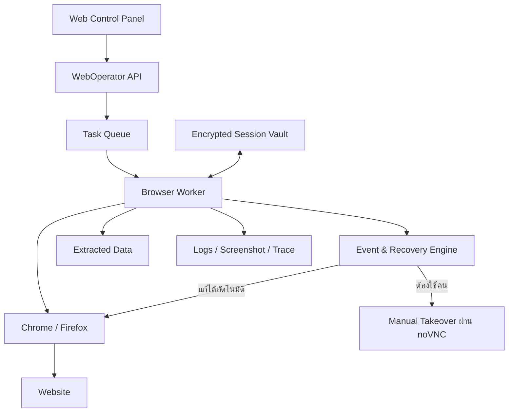
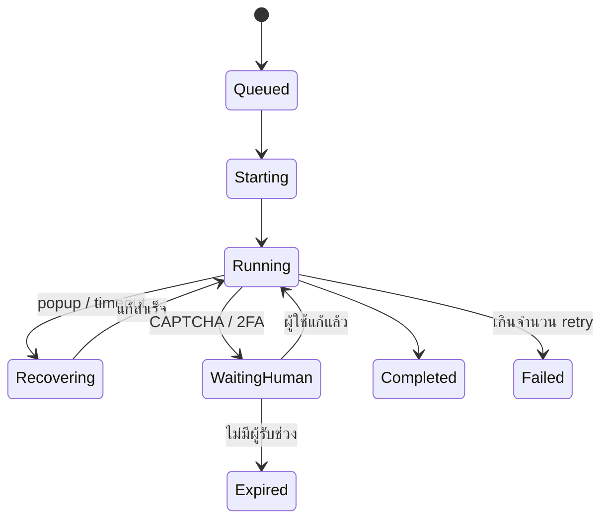

# WebOperator

**WebOperator** คือระบบอัตโนมัติสำหรับเข้าใช้งานเว็บไซต์และ Gmail แทนคน โดยไม่ทำงานเป็นสคริปต์ยาวชุดเดียว แต่แบ่งเป็นส่วนต่าง ๆ ที่แยกความรับผิดชอบชัดเจน:

- ระบบกลางจัดคิวงาน (Task Queue)
- Browser Worker ที่รันใน Docker
- ชุดคำสั่งเฉพาะแต่ละเว็บไซต์ (Site Adapter)
- ระบบจัดการเหตุการณ์ไม่คาดคิด (Event & Recovery Engine)
- หน้าจอควบคุมและรับช่วงทำงานด้วยมือ (Manual Takeover)
- ระบบเก็บ Session/Cookie อย่างเข้ารหัส (Session Vault)

## Repository

- GitHub: <https://github.com/smallscaleserver/WebOperator>
- License: [GNU AGPL v3](./LICENSE)

### Clone

```bash
git clone https://github.com/smallscaleserver/WebOperator.git
cd WebOperator
```

หรือ clone ผ่าน SSH:

```bash
git clone git@github.com:smallscaleserver/WebOperator.git
```

### Phase 1 quickstart

เปิด browser (Chrome หรือ Firefox) แบบเห็นหน้าจอใน Docker แล้วควบคุมผ่านเว็บด้วย noVNC:

```bash
cp .env.example .env
docker compose up browser-worker-chrome   # หรือ browser-worker-firefox
```

เปิด `http://localhost:6080/vnc.html` (Chrome) หรือ `http://localhost:6081/vnc.html` (Firefox) แล้วใส่รหัสผ่านจาก `.env`

สั่งงานผ่าน Playwright แทนการคลิกเองผ่าน noVNC (ต้องเปิด `browser-worker-chrome` ไว้ก่อน):

```bash
docker compose run --rm worker
```

บันทึกและนำ session (cookie/localStorage) กลับมาใช้ใหม่ผ่าน Playwright `storageState`:

```bash
docker compose run --rm worker npm run save
docker compose run --rm worker npm run restore
```

ดูแผนงานละเอียดและ checklist ที่ [`docs/PROJECT_PLAN.md`](./docs/PROJECT_PLAN.md), บริบทสำหรับ AI agent (Claude Code / Codex CLI) ที่ [`AGENTS.md`](./AGENTS.md)

## สารบัญ

- [สถาปัตยกรรมโดยรวม](#สถาปัตยกรรมโดยรวม)
- [เทคโนโลยีที่แนะนำ](#เทคโนโลยีที่แนะนำ)
- [หน้าจอระยะไกล (Manual Takeover)](#หน้าจอระยะไกล-manual-takeover)
- [การเข้าใช้งาน Gmail](#การเข้าใช้งาน-gmail)
- [โครงสร้าง Website Adapter](#โครงสร้าง-website-adapter)
- [ระบบรับมือเหตุการณ์ไม่คาดคิด](#ระบบรับมือเหตุการณ์ไม่คาดคิด)
- [Session และความปลอดภัย](#session-และความปลอดภัย)
- [ภาษาที่เหมาะสม](#ภาษาที่เหมาะสม)
- [สถานะของงาน](#สถานะของงาน)
- [แผนพัฒนา](#แผนพัฒนา)
- [MVP ที่ควรเริ่มจริง](#mvp-ที่ควรเริ่มจริง)

## สถาปัตยกรรมโดยรวม



## เทคโนโลยีที่แนะนำ

### Browser automation: Playwright

เลือก Playwright + TypeScript เป็นแกนหลัก เพราะ:

- รองรับ Chromium, Chrome และ Firefox
- จัดการแท็บ, popup, iframe, download และ dialog ได้ดี
- เก็บ screenshot, video และ trace ย้อนดูปัญหาได้
- ใช้ persistent browser profile ได้
- รองรับ headed mode คือเปิดเบราว์เซอร์จริง ไม่ใช่ทำงานเงียบๆ อย่างเดียว

Playwright มี Docker image และแนวทางตั้งค่า sandbox/seccomp โดยตรงในเอกสาร Docker อย่างเป็นทางการ และรองรับการบันทึก/นำ authentication state กลับมาใช้ใหม่ตามเอกสาร Authentication

## หน้าจอระยะไกล (Manual Takeover)

ภายใน Browser Worker ใช้:

- Xvfb สร้างจอ Linux เสมือน
- Window manager เช่น Fluxbox
- Chrome/Firefox แบบ headed
- x11vnc ส่งภาพหน้าจอ
- noVNC ทำให้ดูและควบคุมผ่านเว็บเบราว์เซอร์ได้

ผู้ดูแลจึงเปิดประมาณนี้ได้:

```
https://server/browser/session-123
```

และเห็น Chrome เหมือน Remote Desktop สามารถคลิก พิมพ์ login ยืนยัน 2FA หรือแก้ปัญหาเฉพาะหน้าได้ noVNC เป็น VNC client ที่ทำงานผ่าน HTML5/WebSocket ตามโครงการ noVNC

## การเข้าใช้งาน Gmail

Gmail ควรแยกเป็นสองวิธี

### วิธีหลัก: Gmail API + OAuth 2.0

สำหรับอ่านหัวข้อ เนื้อหา ไฟล์แนบ ค้นหาอีเมล หรือส่งอีเมล ควรใช้ Gmail API เพราะเสถียรกว่าการเปิดหน้า Gmail แล้วคลิก

- ผู้ใช้กดอนุญาตผ่าน OAuth
- เก็บ refresh token แบบเข้ารหัส
- ขอเฉพาะ scope ที่จำเป็น
- ไม่ต้องเก็บรหัสผ่าน Gmail
- ไม่ต้องรับมือกับหน้า Gmail เปลี่ยน layout

Google กำหนดให้ขอสิทธิ์เท่าที่จำเป็น และ scope บางประเภทอาจต้องผ่านการตรวจสอบก่อนเปิดให้ผู้ใช้ทั่วไป ตามนโยบาย OAuth 2.0 และคู่มือ OAuth สำหรับ Web Server

### วิธีสำรอง: Browser Worker

ใช้เมื่อจำเป็นต้องทำงานบางอย่างที่ API ทำไม่ได้ แต่ไม่ควรพยายามหลบ CAPTCHA หรือระบบรักษาความปลอดภัย หากพบ CAPTCHA, passkey หรือ 2FA ให้หยุดงานแล้วเรียกคนเข้าควบคุม

## โครงสร้าง Website Adapter

แต่ละเว็บไซต์ควรเป็นโมดูลแยก ไม่ hard-code ทุกอย่างรวมกัน:

```
adapters/
├── gmail/
├── supplier-a/
├── customer-portal/
├── government-web/
└── generic-web/
```

ตัวอย่าง interface:

```typescript
interface SiteAdapter {
  detectPage(page): Promise<PageState>;
  login(context): Promise<LoginResult>;
  execute(task, context): Promise<TaskResult>;
  recover(event, context): Promise<RecoveryResult>;
  extract(context): Promise<ExtractedData>;
}
```

แต่ละ adapter มี:

- URL ที่อนุญาต
- วิธีตรวจว่าล็อกอินแล้วหรือยัง
- selector ของปุ่มและช่องข้อมูล
- กฎปิด popup
- กฎดึงข้อมูล
- วิธีตรวจว่าทำงานสำเร็จ
- ระดับความเสี่ยงของ action

## ระบบรับมือเหตุการณ์ไม่คาดคิด

สร้าง Event & Recovery Engine ตรวจเหตุการณ์เป็นลำดับ:

| เหตุการณ์           | การจัดการ                                   |
| -------------------- | -------------------------------------------- |
| Cookie banner         | กดปฏิเสธหรือยอมรับตาม policy                 |
| Popup โปรโมชั่น       | ปิดตาม selector หรือข้อความ                  |
| JavaScript dialog     | บันทึกข้อความแล้ว accept/dismiss             |
| เปิดแท็บใหม่          | ตรวจ URL และผูกเข้ากับ task                  |
| Session หมดอายุ       | ลอง renew session หรือขอ login ใหม่          |
| หน้าโหลดค้าง          | reload หนึ่งครั้ง แล้ว retry แบบมีระยะห่าง   |
| Selector เปลี่ยน      | หาโดย role/text สำรอง                        |
| ดาวน์โหลดไฟล์         | ตรวจชื่อ ขนาด MIME และ checksum              |
| CAPTCHA/2FA/passkey   | หยุดและส่ง Manual Takeover                   |
| URL ผิดโดเมน          | หยุดทันที                                    |
| ทำงานซ้ำหลายครั้ง     | Circuit breaker ป้องกันคลิกหรือส่งข้อมูลซ้ำ  |

ทุก step ควรบันทึก:

- URL และชื่อหน้า
- screenshot ก่อน/หลัง
- DOM snapshot เฉพาะส่วนสำคัญ
- console error และ network error
- เวลาเริ่มและสิ้นสุด
- action ที่ระบบทำ
- ข้อมูลสำคัญต้อง mask ก่อนบันทึก log

## Session และความปลอดภัย

ไม่ควรเก็บ email/password ใน source code หรือไฟล์ .env ธรรมดา

ควรมี Session Vault:

- เข้ารหัส cookie, token และ browser profile
- แยก vault ต่อผู้ใช้และต่อเว็บไซต์
- กำหนดวันหมดอายุ
- revoke session ได้
- ไม่ส่ง cookie กลับไปยังหน้า dashboard
- จำกัด worker ให้ออกอินเทอร์เน็ตได้เฉพาะโดเมนที่กำหนด
- หนึ่ง container ต่อหนึ่ง active session สำหรับเว็บสำคัญ
- noVNC ต้องผ่าน HTTPS, login และ URL อายุสั้น
- เก็บ audit log ว่าใครเข้าควบคุมตอนไหน

## ภาษาที่เหมาะสม

สำหรับระยะแรก แนะนำ:

- **TypeScript/Node.js**: Playwright worker และ website adapters
- **PostgreSQL**: task, account metadata, audit log
- **Redis + BullMQ**: queue, retry, scheduling
- **MinIO/S3**: screenshot, video, download และ trace
- **React หรือ Vue**: Control Panel
- **Docker Compose**: รุ่นเริ่มต้น
- **Go**: ค่อยนำมาใช้กับ API/control plane ภายหลัง หากต้องการ binary เล็กและรองรับ worker จำนวนมาก

แม้ถนัด Go แต่ Playwright ฝั่ง TypeScript มีตัวอย่างและ ecosystem ตรงที่สุด จึงเหมาะกับ Browser Worker มากกว่า ส่วน backend กลางเขียน Go ได้โดยไม่ขัดกัน

## สถานะของงาน



## แผนพัฒนา

### Phase 1 — Prototype

- Docker เปิด Chromium แบบเห็นหน้าจอ
- เชื่อม noVNC
- Control Panel มี Start/Stop/Take control
- เปิดเว็บ ทดลอง login ด้วยมือ
- บันทึกและนำ browser session กลับมาใช้
- ทำ adapter เว็บตัวอย่างหนึ่งเว็บ

### Phase 2 — Task Engine

- Queue และ scheduler
- Step-based workflow
- screenshot/trace ทุกจุดสำคัญ
- retry, timeout และ circuit breaker
- ดาวน์โหลดและจัดเก็บข้อมูล

### Phase 3 — Gmail

- Google OAuth
- อ่าน ค้นหา และดาวน์โหลดไฟล์แนบผ่าน Gmail API
- Browser fallback เฉพาะกรณีจำเป็น
- Encrypted token vault

### Phase 4 — Universal Adapters

- ระบบ plugin สำหรับเพิ่มเว็บไซต์
- Popup rules กลาง
- page-state detection
- selector หลายระดับ: role → label → text → CSS
- workflow versioning เพื่อย้อนกลับเมื่อเว็บเปลี่ยน

### Phase 5 — Production

- แยก worker หลายเครื่อง
- Chrome และ Firefox profiles
- สิทธิ์ผู้ใช้และ audit log
- domain allowlist
- monitoring และแจ้งเตือน
- backup/restore session vault

## MVP ที่ควรเริ่มจริง

รุ่นแรกไม่ต้องพยายาม "เข้าได้ทุกเว็บ" เพราะแต่ละเว็บมี login และโครงสร้างต่างกัน ควรตั้งเป้าเป็น:

> WebOperator MVP สามารถเปิด Chromium ใน Docker, แสดงและควบคุมผ่าน noVNC, เก็บ session แบบเข้ารหัส, ทำ workflow ทีละ step, ปิด popup พื้นฐาน, หยุดรอคนเมื่อพบ 2FA/CAPTCHA และดึงข้อมูลจาก Gmail API กับเว็บไซต์ตัวอย่างหนึ่งแห่งได้

โครงสร้างนี้จะขยายเป็นระบบ universal ได้จริง และไม่เปราะเท่าการสร้างบอตที่อาศัยการคลิกตามตำแหน่งหน้าจอเพียงอย่างเดียว

## License

โปรเจกต์นี้เผยแพร่ภายใต้ [GNU Affero General Public License v3.0](./LICENSE)
